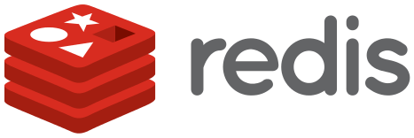

class: center, middle

# Redis

---

# Agenda

Redis

Key feature

Other feature

Deep dive : Monothread
Deep dive : Memory
Deep dive : Persistance

Redis cli

Latency doctor

Redis sentinelles

Redis cluster

---

# C'est quoi redis ?
 
 * Key/Value Store
 
 * Toutes les données sont stoquées en mémoire
 
 * Toutes les clées peuvent avoir (ou non) une date d'expiration (TTL)
 
 * C'est rapide
 
 * C'est léger
 

---

# Mais aussi ...

 * La possibilité de persister les données sur disques
 
 * Des types de données avancées (Counter, List, Set, Sorted Set ...)
 
 * Un cache LRU out-of-the-box
 
 * Une fonctionnalitées de Souscription / Publication (Broker de message lite)
 
 * De la réplication (Redis Sentinel)

 * Du Sharding (Redis cluster)
 
 * Très rapide
 
--- 

# Et pour finir (Sur l'intro)

 * C'est open sources (BSD licensed)
 
 * Une documentation très fourni (https://redis.io/documentation)
 
 * C'est du C ANSI
 
 * Aucune dépendences externes

---

# Focus sur les perfs

 * Mono threadé
 
 * Tout doit etre in-memmory
 
 * Impact de l'activation de la persistance fort
  
 * Tunning Système quasi obligatoir
    # TODO a détailler

---

# Focus sur la persistance

 * RDB mode : point-in-time snapshot
 
 * AOF mode : Chaque opération d'écriture est logguées
 
 * On peut activer l'un ou l'autre, les deux ou rien
 
 * Plus de détail ici : https://redis.io/topics/persistence

---

# Sources
 
* https://redis.io

---